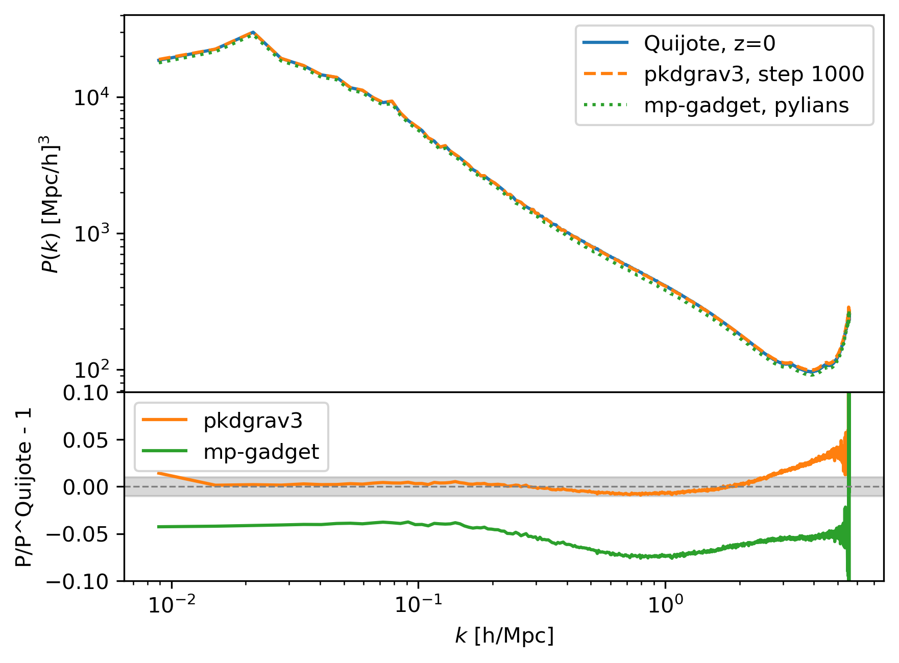
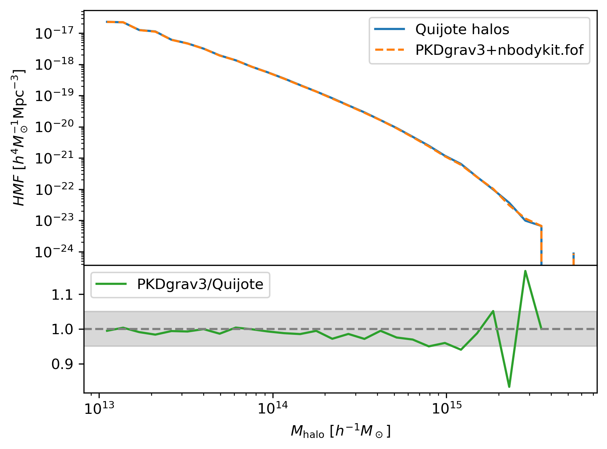
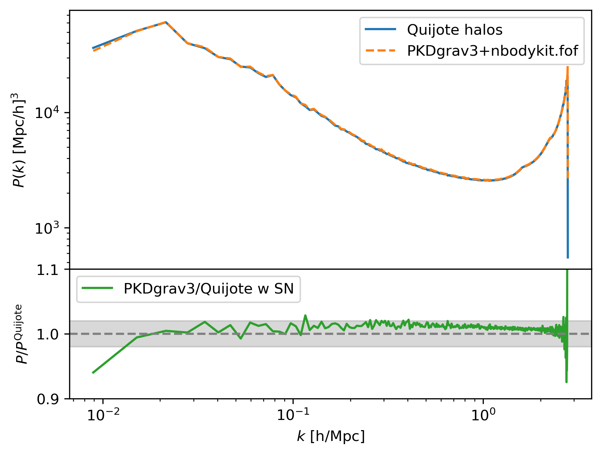

# Nbody codes 

We test several Nbody codes. 
These works are done on a remote computer, so pay attention to the paths.

Read the details in [Cheng's notes](./nbody-code.md).

## PKDgrav3

We test the [PKDgrav3 code](https://pkdgrav3.readthedocs.io/en/latest/) on a computer with GPU, named 'r88'. 
We show the scripts and configuration files, but there are 2 'lib' codes keeped on `r88` but not this repo: 1. the PKDgrav3 code, 2. the 2LPT code used is the version same as Quijote's.

The test is with the following settings:
- L=1Gpc/h, N=512^3,
- z_i=127, z_f=0, Nstep=100, 
- the IC is generated by 2LPT code, the origin format is gadget, and then convert to hdf5 as PKDgrav3 code need.
- gpu: 3090/H200; cpu: 32 cores, 128 threads.
It takes ~2 hours on 3090, or ~1 hour on H200.

We also test the code without GPU acceleration on H200, it takes half an hour more.

### FoF Halos

The inputs at this step are: `<linking length> [minimum particle number]`, refer to [Quijote paper](https://arxiv.org/abs/1909.05273), the linking length is 0.2 times the mean interparticle separation, and the minimum particle number is 20.

We first try to find FoF halos with the PKDgrav3 code. Refer the [docs](https://pkdgrav3.readthedocs.io/en/latest/extensions.html#PKDGRAV.fof), and see also the [issue](https://bitbucket.org/dpotter/pkdgrav3/issues/39/an-error-in-postprocessing-fof-halo-finder). But it seems there are still some bugs in the code, it takes a long time to run without useful output.

Then we choose [nbodykit.algorithms.fof.FOF](https://nbodykit.readthedocs.io/en/latest/api/_autosummary/nbodykit.algorithms.fof.html#nbodykit.algorithms.fof.FOF) to find the FoF halos. See `pkd_nbfof.py`, where we first read Tipsy snapshots to get particles positions and velocities, and then run the FoF algorithm. Finally, the output is saved in bigfile format.

We find that the nbodykit FoF algorithm saves the halos with particle numbers > than `nmin`, but not equal, so we reset `nmin` to 19 to be consistant with the Quijote paper.
It takes ~20 mins to find halos with 512^3 particles, no parallel.

## MP-Gadget

We test the [MP-Gadget code](https://github.com/MP-Gadget/MP-Gadget) with the same configurations as Quijote.

- The input IC and output snapshot of MP-Gadget is in bigfile format.

## Results 

### Matter Power Spectrum

The shadow region is 1%, as [a paper](https://arxiv.org/pdf/1503.05920) suggested. Their conclusion is that the differences between `pkdgrav3`, `gadget3` and `Ramses` are within 1% for $k<1h/{\rm Mpc}$, and 3% for $k<10h/{\rm Mpc}$. (The last one is out of our resolution.)

In our results, pkdgrav3 agrees well with Quijote (except the first point). But MP-Gadget is not, it may be due to some configurations are not the same as Quijote, still need to check.

### Halo Mass Function

We compare the HMF with Quijote, as [Quijote doc/Reading FoF](https://quijote-simulations.readthedocs.io/en/latest/Examples/Reading_FoF.html) suggested. See `plot/HMF.py` for the details.

The results are 

The shadow region is 5%. 
PKDgrav3 agrees well with Quijote except the largest halos, but it seems that our HMF is more smooth.

### Halo Power Spectrum

We compare the halo power spectrum with Quijote. The halos of Quijote are downloaded from the public data, while the power spectra of halos are measured by the `Pylians` code with the same settings, refer `halo_ps.py` for the details.

The results are 

The shadow region is 2%. The two cases are consistent in a wide region except the first point.